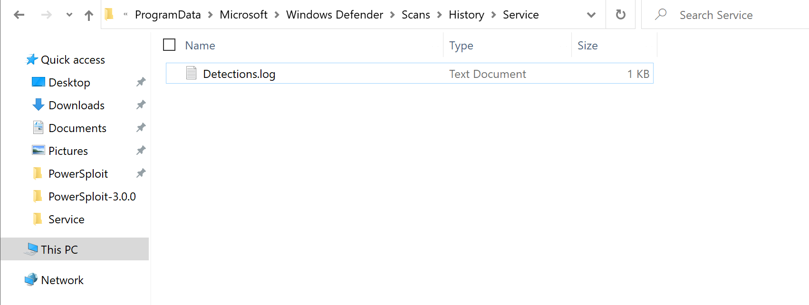

# POC 1 - Exploiting Microsoft’s Active Directory

## Description


## Steps to Carry Out Exploitation

There are a total of 3 steps to be caried out 

### Preparations

1. Download the PowerSploit repository

```
https://github.com/PowerShellMafia/PowerSploit/releases/tag/v3.0.0 
```


2. Upload the PowerSploit folder into a thumbdrive or storage device


### Exploitation

1. Configure the Windows Defender as follows

```
Virus & Threat Protection > Virus & Threat Protection Settings > Manage Settings > Exclusions > Add or Remove Exclusions

Add Exclusion the following path

C:\Windows\System32\WindowsPowerShell
```


2. Navigate to the following directory and upload the PowerSploit folder
   
```
C:\Windows\System32\WindowsPowerShell\v1.0\Modules
```


3. Execute the following PowerShell Script

```ps1
$Env:PSModulePath.Split(';') | % { if ( Test-Path (Join-Path $_ PowerSploit) ) {Get-ChildItem $_ -Recurse | Unblock-File} }


```

### Covering Tracks

1. Navigate to the following path

```
C:\ProgramData\Microsoft\Windows Defender\Scans\History\Service
```


2. Select all files within the folder and delete the files

```
**NOTE**

If the file cannot be deleted, Manually clear the file content and save the file
```




## Possible Mitigations


## References

https://github.com/PowerShellMafia/PowerSploit
